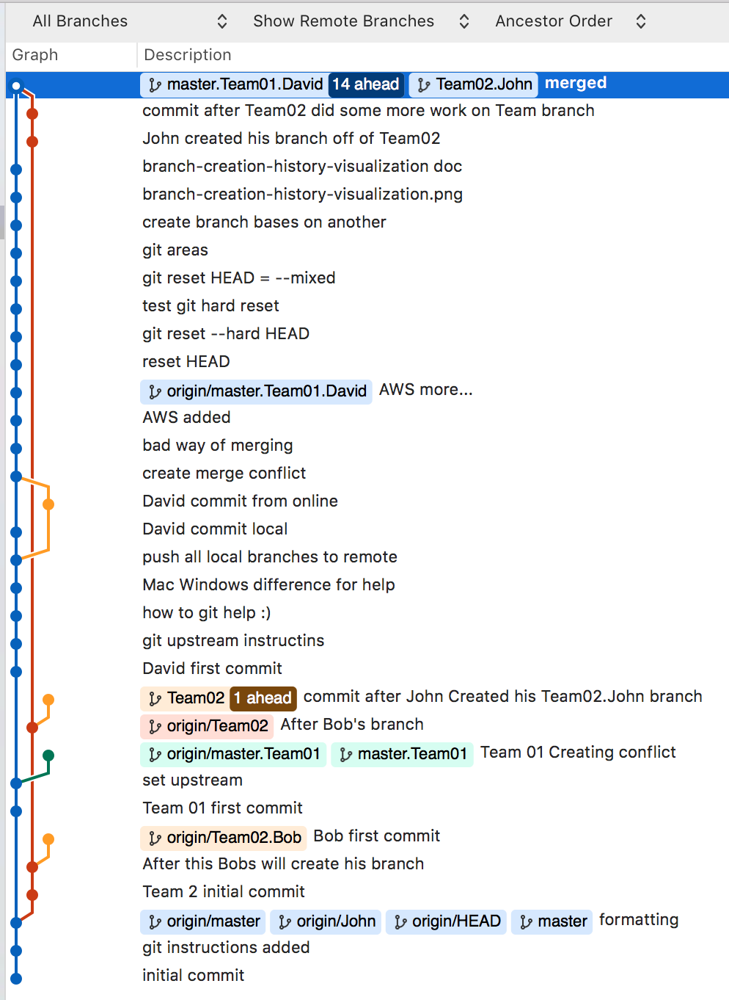

## Compass Playground Team 01 David

## Compass Playground Team 02
 
## Upload initial branch:
`git remote add origin https://github.com/Compass-UI/Playground.git`

### create a new repository on the command line

### Pull Request 01

`echo "# Playground" >> README.md`

`git init`

`git add README.md`

`git commit -m "first commit"`

`git remote add origin https://github.com/Compass-UI/Playground.git`

`git push -u origin master`

### or push an existing repository from the command line

`git remote add origin https://github.com/Compass-UI/Playground.git`

`git push -u origin master`

### To push the current branch and set the remote as upstream, use

`git push --set-upstream origin master.Team01`

### Create your branch:

`git branch  master.Team01.David`

### set upstream branch

`$ git push --set-upstream master.Team01.David` 

### Open manual page to get help

`git push --help`

#### On Mac will print man page, on Windows will open the following page:
`file:///C:/Program%20Files/Git/mingw64/share/doc/git-doc/git-push.html`

### Push all local branches to remote

`git push --all`

### Merge conflicts

`gemini-david 🌴 : git push
To https://github.com/Compass-UI/Playground.git
 ! [rejected]        master.Team01.David -> master.Team01.David (fetch first)
error: failed to push some refs to 'https://github.com/Compass-UI/Playground.git'
hint: Updates were rejected because the remote contains work that you do
hint: not have locally. This is usually caused by another repository pushing
hint: to the same ref. You may want to first integrate the remote changes
hint: (e.g., 'git pull ...') before pushing again.
hint: See the 'Note about fast-forwards' in 'git push --help' for details.
gemini-david 🌴 :`

## git reset HEAD

### I am resetting HEAD --hard <-- this should not be here>

### Default reset is --mixed

`git reset HEAD` is the same as `git reset HEAD --mixed`

## 4 Git Areas

1. Stash
2. Workspace
3. Staging/Index
4. Repository

## Git-flow
[Git-flow on github](https://github.com/nvie/gitflow)

### Branch creation history visualization

## How did I create my branch from Team02

`gemini-david 🌴 : git branch
  master
  master.Team01
* master.Team01.David
gemini-david 🌴 : pwd
/Users/v738110/Compass/Playground/Playground
gemini-david 🌴 : git branch
* Team02
  master
  master.Team01
  master.Team01.David
gemini-david 🌴 : git checkout -b Team02.John Team02
Switched to a new branch 'Team02.John'
gemini-david 🌴 :`

## This commit is done after Team02 did some more work on Team branch

## After merge:

## Stash

`gemini-david 🌴 : git stash --include-untracked`

`gemini-david 🌴 : git stash list`
## Do some work and Stash
 
## Trash branch created before this commit

## The side marked `<<<<<<HEAD` is current commit

## Merge conflict from

## Both sides of merge conflict

## reset HEAD

* can reset entire index
* or you can reset a single file

## History

`gemini-david 🌴 : git log --graph --decorate`

`gemini-david 🌴 : git log --graph --decorate --oneline`

### Show parent commit of HEAD
`gemini-david 🌴 : git show HEAD^`

#### Can get very suphisticated

`gemini-david 🌴 : git show HEAD@{"1 month ago"}`

### Who changed a specific file:

`gemini-david 🌴 : git blame REAME.md`

### Get difference between currenr comment and 2 commits earlier

`gemini-david 🌴 : git diff HEAD HEAD~2`

`gemini-david 🌴 : git log --patch`

### Show me commits that contain word git in it

`gemini-david 🌴 : git log --grep git --oneline`

### Show all commits between and master.Team01.David and master

`gemini-david 🌴 : git log master.Team01.David master --oneline`

### clean up multiple commits with ammend

`git commit --amend`

* commit 1

* commit 2

* commit 3

* commit 4

### Rebase

`git rebase -i origin/master` ← change history from this commit ( origin/master ) onward

`git rebase --continue`
